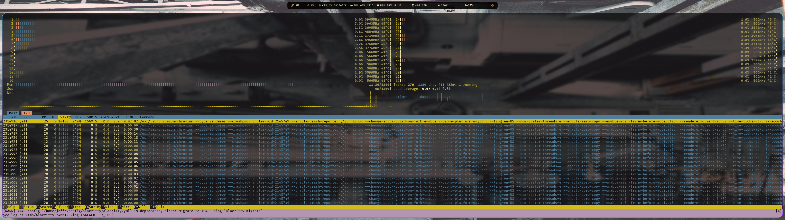
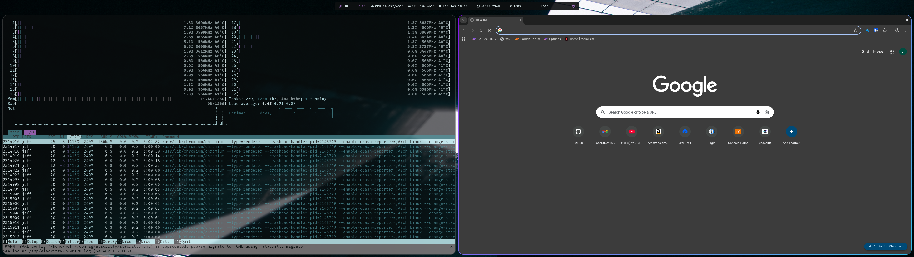
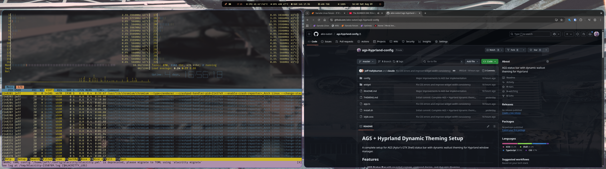

# Screenshot Gallery

A collection of examples showing how the bar adapts to different wallpapers.

## About

Each image shows the same bar with a different wallpaper. The color scheme is automatically extracted from the wallpaper using Wallust - no configuration needed. Change your wallpaper, and the bar instantly adapts with matching colors.