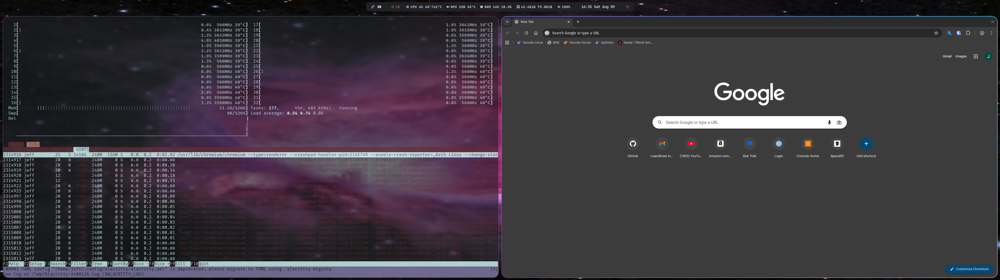
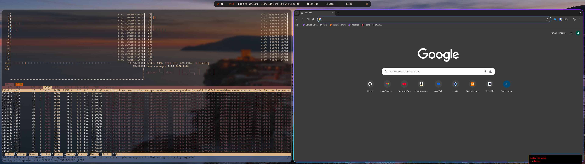
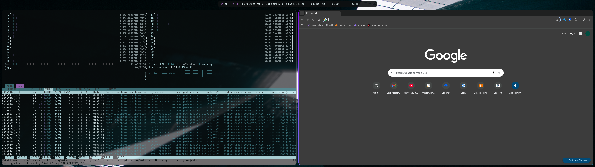
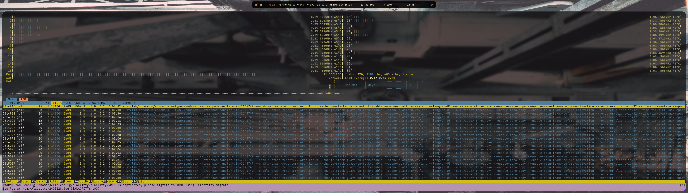
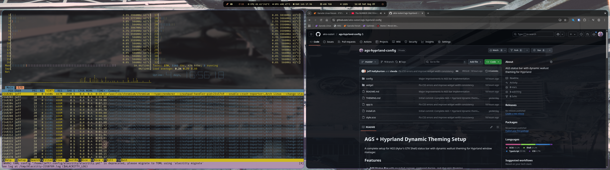

# Screenshot Gallery

These screenshots demonstrate the AGS Hyprland Config bar with automatic wallpaper-based theming.

## Dynamic Theming Examples

### Dark Theme

The bar automatically adapts to dark wallpapers with appropriate contrast and color extraction.

### Light Theme  

Light wallpapers trigger adjusted color schemes maintaining readability.

### Gaming Mode

Gaming mode (Super+Ctrl+G) inverts the color scheme using the wallpaper's accent color as the background.

### Keyboard Shortcuts Overlay

Interactive shortcuts reference accessible via the keyboard icon in the bar.

### Additional Theme Examples

Natural color extraction from forest wallpapers.

Cool blue tones extracted from ocean-themed wallpapers.

Example of the bar in a typical desktop environment.

## Technical Details

- **Resolution**: 3840x2160 (4K)
- **Window Manager**: Hyprland
- **Font**: JetBrainsMono Nerd Font (Bold, 14px)
- **Bar Opacity**: 90%
- **Color Generation**: Wallust with kmeans backend

## Configuration

The bar appearance is entirely determined by the current wallpaper. No manual theme configuration is required. Colors are extracted automatically and applied system-wide.

To change themes, simply change your wallpaper. The bar will adapt immediately.